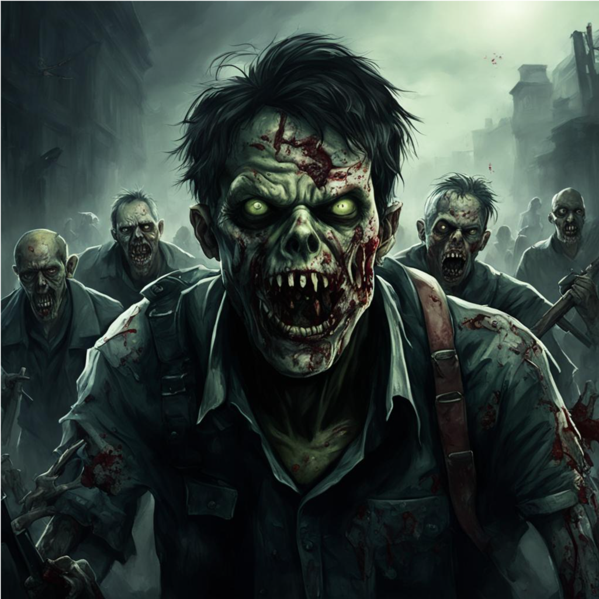
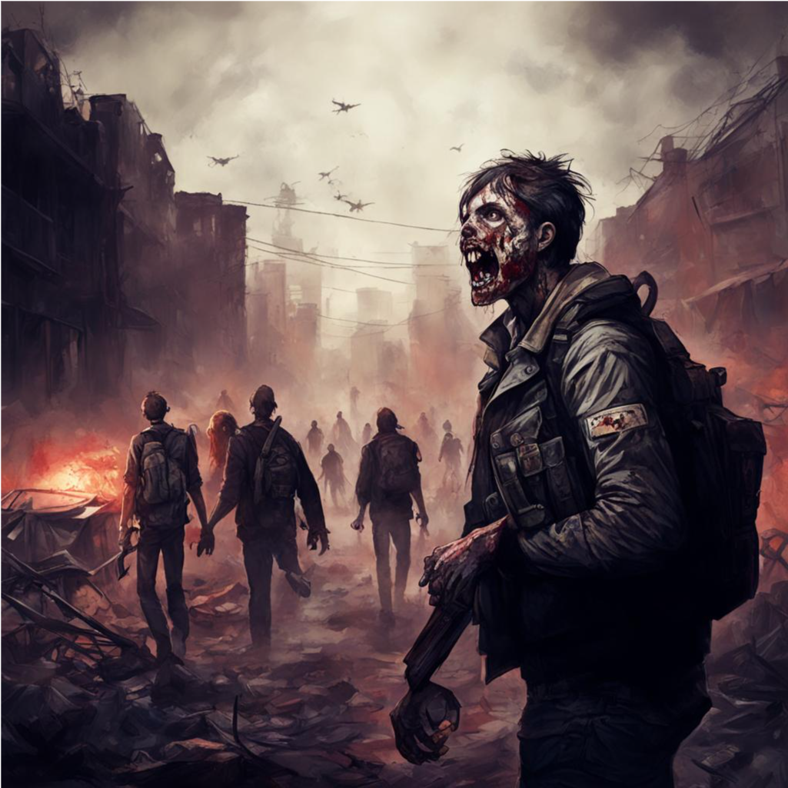

# ochenkrutayaigra
## Добро пожаловать в мир зомби апокалипсиса, где каждый шаг может стать последним! 
## В этой игре вы сможете:
```
- Исследовать разрушенный город, искать ресурсы и оружие.
- Строить укрытия и улучшать их, чтобы защититься от зомби.
- Сражаться с ордами зомби, используя различные виды оружия и тактики.
- Выполнять задания и миссии, которые помогут вам выжить и продвигаться в игре.
- Взаимодействовать с другими выжившими, обмениваться ресурсами и информацией.
- Принимать сложные решения, которые будут влиять на вашу судьбу и судьбу других персонажей.
- Разгадывать головоломки и искать способы выжить в опасном мире зомби апокалипсиса.
- Улучшать навыки и способности вашего персонажа, чтобы стать более эффективным выживальщиком.
- Погружаться в захватывающий сюжет и испытывать настоящие эмоции выживания в мире хаоса.
```

### Как начать играть:
```
Начать играть в нашу новую игру очень просто. Сначала вам нужно выбрать своего персонажа из нескольких 
доступных опций - от бывшего военного до медика или простого гражданина. Каждый персонаж имеет свои 
уникальные навыки и способности, которые помогут вам выжить в этом опасном мире.
```

## Особенности нашей игры:
```
- Реалистичная графика и атмосфера: игра предлагает качественную трехмерную графику и звуковое 
сопровождение, создающие невероятно атмосферное погружение в мир зомби апокалипсиса.
- Динамичный геймплей: игра предлагает разнообразные события, задания и миссии, которые 
поддерживают интерес и динамику процесса выживания.
- Система строительства и улучшения укрытий: игроки могут создавать свои укрытия, укреплять их, 
устанавливать ловушки и оборонительные сооружения для защиты от зомби.
- Разнообразие оружия и инвентаря: игроки могут использовать различные виды оружия – от 
огнестрельного до холодного – чтобы справиться с зомби и другими опасностями.
- Интерактивность с окружающим миром: игроки могут взаимодействовать с объектами, персонажами и 
другими игроками, что создает более глубокий и реалистичный игровой мир.
- Развитие персонажа: игроки могут улучшать навыки и способности своего персонажа, делая его 
более сильным и эффективным в выживании.
- Сюжетная линия: игра предлагает захватывающий сюжет с неожиданными поворотами и интересными 
персонажами, которые добавляют глубину и эмоциональную составляющую к игровому процессу.
```
## Лицензия:
```
Лицензионное соглашение для игры "ochenkrutayaigra" выдано компанией "ochenkrutayakompaniya"
```
## Авторы:
```
Неклюдов И.С.
```
